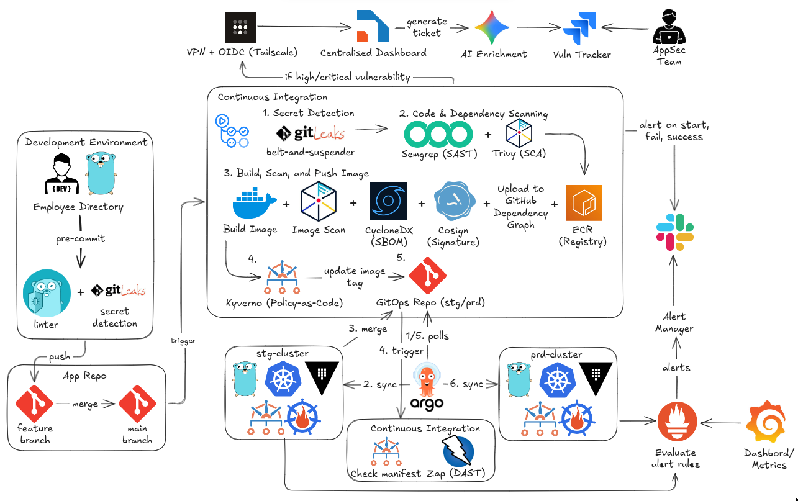
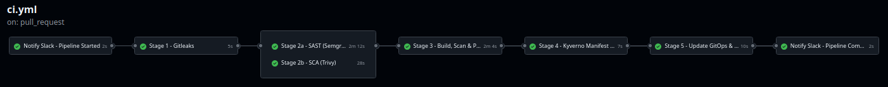
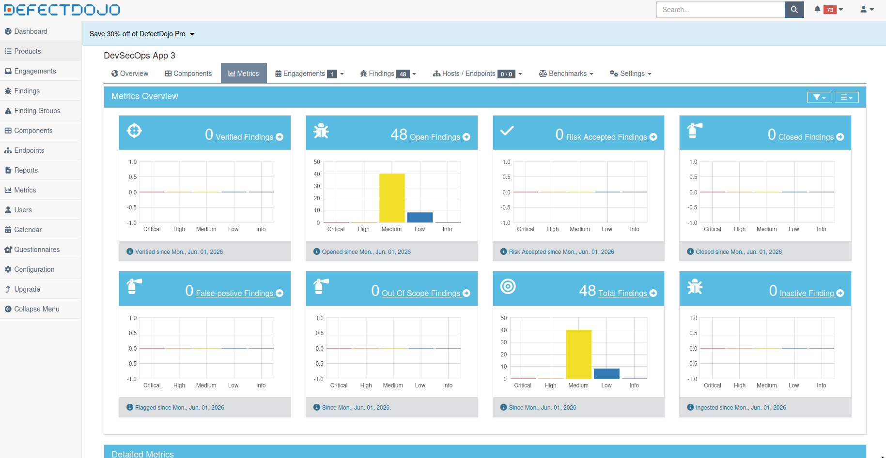
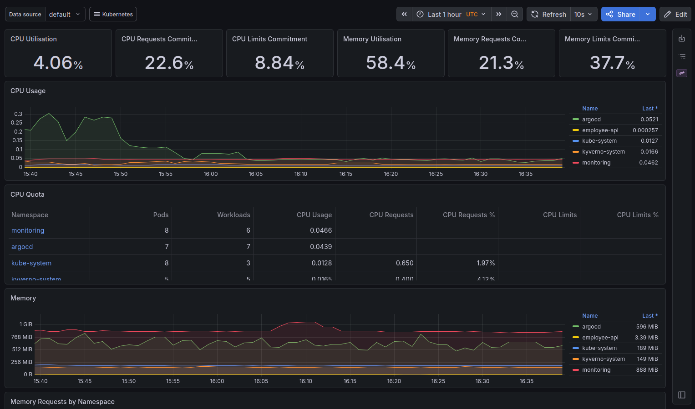
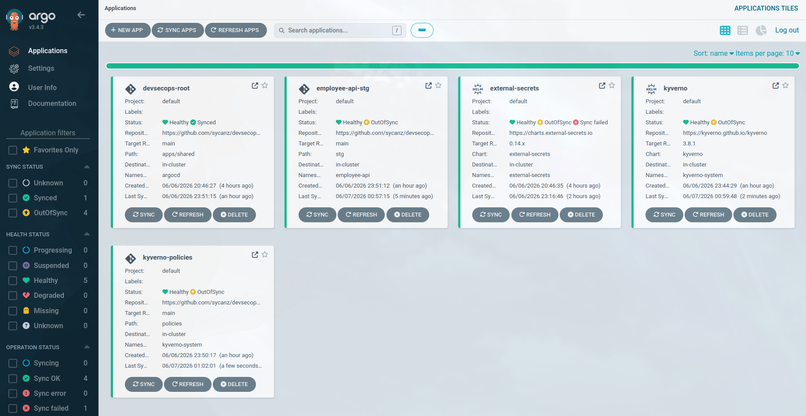
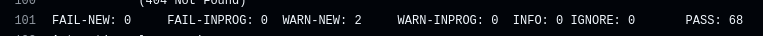

# DevSecOps Portfolio — Cloud-Native Security Pipeline

[]()
[]()
[]()
[]()
[]()
[]()

End-to-end DevSecOps pipeline securing a Go Employee Directory API on AWS EKS. Shift-left security with SAST, SCA, secrets scanning, container image signing, policy-as-code enforcement, DAST, and centralized vulnerability management.

---

## Architecture



---

## Tech Stack

| Category | Tools |
|----------|-------|
| **Infrastructure** | Terraform, AWS EKS, ECR, VPC, IAM, KMS |
| **CI/CD** | GitHub Actions, ArgoCD (GitOps) |
| **Security Scanning** | SemGrep (SAST), Trivy (SCA/IaC/Image), Gitleaks (Secrets) |
| **Policy Enforcement** | Kyverno (6 admission policies) |
| **Image Security** | Cosign (keyless signing), ECR (immutable tags), CycloneDX SBOM |
| **DAST** | OWASP ZAP baseline scan |
| **Vulnerability Mgmt** | DefectDojo (aggregation + dedup) |
| **Monitoring** | Prometheus, Grafana, Alertmanager, kube-state-metrics, node-exporter |
| **Application** | Go, chi router, SQLite, JWT auth, RBAC, PII encryption |
| **Connectivity** | Tailscale, AWS SSM Session Manager |
| **Compliance** | GDPR (primary), SOC2 (secondary) |

---

## Pipeline Overview

```
Push to main
  │
  ├─ Stage 1: Gitleaks ───────────── Secrets detection
  ├─ Stage 2a: SemGrep ──────────── SAST → DefectDojo
  ├─ Stage 2b: Trivy (FS + IaC) ─── SCA → DefectDojo
  ├─ Stage 3: Build + Sign + SBOM ─ Docker → ECR, Cosign sign
  │                                   Trivy image scan → DefectDojo
  │                                   CycloneDX SBOM artifact
  ├─ Stage 4: Kyverno CLI ────────── Policy validation (shift-left)
  └─ Stage 5: Deploy ─────────────── Update gitops-repo → ArgoCD syncs EKS
```

**PR Validation** (gitops-repo):
```
Kyverno CLI → OWASP ZAP DAST → DefectDojo → Summary Gate
```

---

## Kyverno Policies Enforced

| Policy | Description |
|--------|-------------|
| `drop-all-capabilities` | Containers must drop ALL capabilities |
| `disallow-privileged-containers` | No privileged containers |
| `disallow-privilege-escalation` | Block privilege escalation |
| `disallow-root-user` | Enforce runAsNonRoot |
| `require-ro-rootfs` | Read-only root filesystem |
| `require-pod-probes` | Liveness + readiness probes required |

All policies tested in CI dry-run before deploying.

---

## Screenshots

### CI Pipeline


### DefectDojo Findings


### Grafana Dashboard


### ArgoCD Application View


### OWASP ZAP DAST


### Jira Auto-Ticketing


---

## Repository Structure

### app-repo (sycanz/devsecops)
```
terraform/          ← EKS, ECR, IAM, VPC (modules)
app/                ← Go Employee Directory API
  cmd/, internal/   ← handlers, middleware, store, crypto
scripts/            ← eks-toggle.sh (on/off cluster for cost)
local-dev/          ← Minikube setup for local testing
.github/workflows/  ← ci.yml (5-stage pipeline)
```

### gitops-repo (sycanz/devsecops-gitops)
```
apps/shared/        ← Kyverno, policies, external-secrets (both clusters)
apps/stg/           ← Employee API (stg only)
apps/prd/           ← Employee API (prd only — future)
stg/, prd/          ← Deployment manifests (image tags updated by CI)
policies/           ← 6 Kyverno ClusterPolicies
charts/             ← Monitoring Helm values
.github/workflows/  ← validate.yml (PR validation: Kyverno + ZAP)
```

---

## Getting Started

### Prerequisites
- AWS account, Terraform, AWS CLI, session-manager-plugin
- GitHub account with PAT and secrets configured
- Tailscale (for DefectDojo connectivity)

### Deploy Infrastructure
```bash
cd terraform
terraform init
terraform apply
```

### Start Cluster
```bash
./scripts/eks-toggle.sh start
```

### Connect via SSM Tunnel
```bash
# Terminal 1
INSTANCE_ID=$(aws ec2 describe-instances --filters "Name=tag:eks:cluster-name,Values=devsecops-cluster" --query "Reservations[0].Instances[0].InstanceId" --output text)
EKS_ENDPOINT=$(aws eks describe-cluster --name devsecops-cluster --query "cluster.endpoint" --output text | sed 's|https://||')
aws ssm start-session --target "$INSTANCE_ID" --document-name AWS-StartPortForwardingSessionToRemoteHost --parameters "{\"host\":[\"$EKS_ENDPOINT\"],\"portNumber\":[\"443\"],\"localPortNumber\":[\"8443\"]}"

# Terminal 2
aws eks update-kubeconfig --name devsecops-cluster --region ap-southeast-1
CLUSTER_NAME=$(kubectl config view --minify --raw -o json | jq -r '.["current-context"] as $ctx | .contexts[] | select(.name == $ctx) | .context.cluster')
kubectl config set clusters.$CLUSTER_NAME.server https://localhost:8443
kubectl config set clusters.$CLUSTER_NAME.insecure-skip-tls-verify true
kubectl config unset clusters.$CLUSTER_NAME.certificate-authority-data
```

### Bootstrap the Cluster
```bash
helm install argocd argo/argo-cd -n argocd --create-namespace
kubectl apply -f https://raw.githubusercontent.com/sycanz/devsecops-gitops/main/root-app-stg.yaml
helm install monitoring prometheus-community/kube-prometheus-stack -n monitoring --create-namespace
```

### Access Grafana
```bash
kubectl port-forward -n monitoring svc/prometheus-grafana 3000:80
kubectl get secret -n monitoring prometheus-grafana -o jsonpath="{.data.admin-password}" | base64 -d
```

### Test Locally (Minikube)
```bash
cd local-dev
./setup.sh
```

---

## Current Status

| Feature | Status |
|---------|--------|
| EKS cluster (stg) | ✅ Live |
| CI/CD pipeline (5 stages) | ✅ Passing |
| ArgoCD GitOps | ✅ Synced |
| Kyverno policies (6 of 7) | ✅ Enforcing |
| Container image signing (Cosign) | ✅ Working |
| OWASP ZAP DAST (68/68) | ✅ Passing |
| DefectDojo aggregation | ✅ Ingesting |
| Prometheus + Grafana | ✅ Dashboard ready |
| PR validation (validate.yml) | ✅ Kyverno + ZAP + DefectDojo |
| SBOM (CycloneDX) | ✅ Generated in CI |
| Slack notifications | ✅ Pipeline events |
| EKS cost toggle | ✅ On/off script |

| In Progress |
|-------------|
| Vault secret management |
| Jira auto-ticketing |
| verifiy-image policy (ECR auth fix needed) |
| prd cluster |
| Canary deployments (ArgoCD Rollouts) |

---

## Compliance Context

The Employee Directory API stores PII (names, emails) and sensitive data (salaries), making GDPR the primary compliance framework. SOC2 serves as a secondary reference for operational controls.

- **GDPR Art. 32**: Encryption at rest (KMS), encryption in transit (TLS), access controls (RBAC + JWT)
- **GDPR Art. 30**: Data audit trail (SQLite audit log), erasure endpoint
- **SOC2 CC6.1**: Logical access controls via Kyverno admission policies
- **SOC2 CC7.1**: Vulnerability scanning (Trivy, SemGrep, ZAP) → DefectDojo
- **SOC2 CC3.2**: Incident detection via Prometheus alerts

---

## About This Project

Built as a portfolio project to demonstrate cloud-native security engineering skills. Ongoing work — CD pipeline refinement, Vault integration, and Jira automation in progress. Open to feedback and collaboration.

*If you're hiring for DevSecOps, cloud security, or platform engineering — my DMs are open.*
